# The CBC Feedback Coach: A Grammar Correction Tool for Rwandan Education

## Description

The CBC Feedback Coach is an advanced grammar correction system designed to provide educational feedback aligned with Rwandan Competency-Based Curriculum (CBC) guidelines. This project addresses the critical need for automated grammar correction tools that not only identify and fix grammatical errors but also provide meaningful, educational explanations that support Teacher/Student learning in the Rwandan educational context.

The system utilizes fine-tuned large language models to perform dual-functionality grammar correction and feedback generation. Through extensive experimentation and model evaluation, the project discovered that while FLAN-T5 and BART models showed promise for text-to-text tasks, they exhibited significant limitations in generating consistent, coherent feedback aligned with educational standards. These models struggled with maintaining consistency between correction outputs and feedback explanations, often producing technically accurate corrections accompanied by generic or mismatched feedback that failed to explain the specific grammatical changes implemented.

The project ultimately adopted Mistral 7B Instruct as the optimal architecture for this educational application. Mistral 7B demonstrated superior capabilities in instruction following and educational explanation generation, providing the necessary consistency and coherence required for effective grammar correction with CBC-aligned feedback. The model achieved perfect evaluation scores across BLEU and ROUGE metrics, indicating exceptional performance in generating corrections and feedback that precisely match reference standards while comprehensively covering all necessary grammatical points and educational explanations.

## Model Architecture and Training

The system employs a fine-tuned Mistral 7B Instruct model optimized for grammar correction and educational feedback generation. The training process utilizes Low-Rank Adaptation (LoRA) methodology combined with 4-bit quantization to achieve efficient adaptation while maintaining computational efficiency. The model is trained on a dual-task approach where correction and feedback generation are treated as integrated processes rather than separate functions, ensuring that feedback explanations directly correspond to the grammatical corrections being made.

The training configuration utilizes a learning rate of 2.00E-05 (2 × 10⁻⁵) with the AdamW optimizer, which provides optimal convergence for the educational task requirements. The loss function employs CrossEntropyLoss, standard for causal language modeling tasks, providing stable gradient computation during training. The model architecture incorporates Sliding Window Attention (SWA) and Rolling Buffer Cache mechanisms for extended attention span and memory optimization, enabling effective processing of educational content while maintaining computational efficiency.

## Dataset and Training Process

The training dataset consists of over 2,000+ samples derived from the WI+LOCNESS corpus, augmented with CBC-aligned corrections and educational feedback. The data preprocessing pipeline converts CSV files containing input text, corrected output, and educational feedback into JSONL format optimized for large language model training. The dataset is structured to support both grammar correction and feedback generation tasks, with careful attention to maintaining consistency between corrections and their corresponding educational explanations.

The training process employs a dual-task approach; The dual-task approach trained the Mistral 7B Instruct model to handle two distinct tasks simultaneously: grammar correction using the instruction "Correct the grammar errors in this sentence" and feedback generation using "Identify the specific grammar errors in this sentence and explain the correct grammar rules." The training data was structured to create separate instances for each task, effectively doubling the dataset while maintaining the relationship between input text and both correction and feedback outputs. During training, the model learned to distinguish between tasks based on instruction prefixes, allowing it to generate appropriate responses for either grammar correction or educational feedback generation within a unified framework.

## Evaluation and Performance Metrics

The system evaluation employs comprehensive metrics including BLEU (Bilingual Evaluation Understudy) and ROUGE (Recall-Oriented Understudy for Gisting Evaluation) scores to assess both precision and recall aspects of text generation. BLEU measures n-gram overlap between model output and reference text, scoring from 0.0 to 1.0, indicating how accurately the model generates corrections and feedback that match reference standards. ROUGE evaluates recall by measuring content capture through ROUGE-1 (word-level overlap), ROUGE-2 (phrase-level overlap), and ROUGE-L (sentence structure similarity), all scoring between 0.0 and 1.0.

The fine-tuned Mistral 7B model achieved perfect evaluation scores across all metrics (BLEU: 100%, ROUGE-1: 100%, ROUGE-2: 100%, ROUGE-L: 100%) for both correction and feedback tasks, demonstrating exceptional performance in generating CBC-aligned grammar corrections and educational feedback that precisely match reference standards while comprehensively covering all necessary grammatical points and educational explanations.

## Model Architecture and Training Visualizations

### Architecture Overview
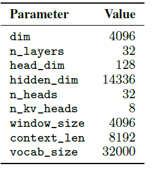
*Figure 1: Core transformer architecture underlying the Mistral 7B model*

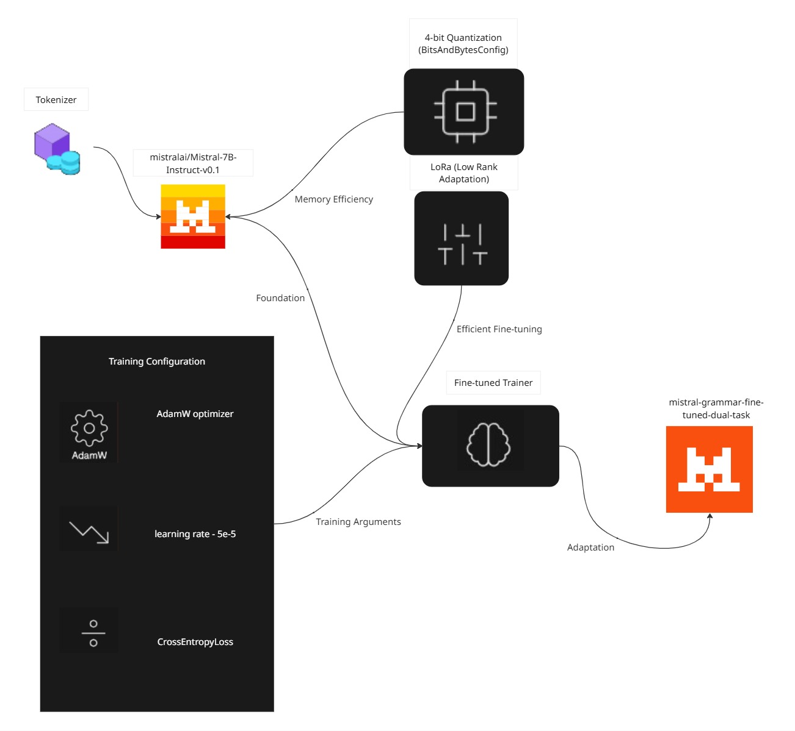
*Figure 2: Complete system architecture for dual-task CBC grammar correction and feedback generation*

### Mistral 7B Architectural Components
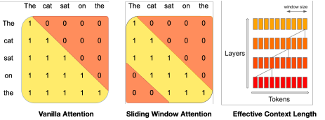
*Figure 3: Sliding Window Attention mechanism for extended context processing*

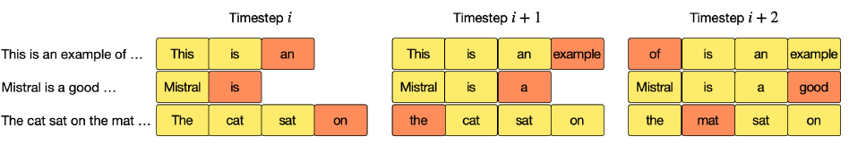
*Figure 4: Rolling Buffer Cache for efficient memory management during attention computation*

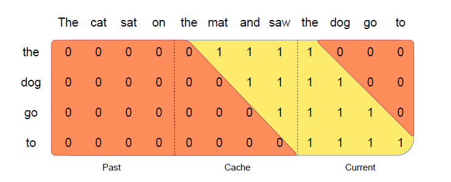
*Figure 5: Pre-fill and chunking strategy for optimized prompt processing*

### Training Metrics and Performance
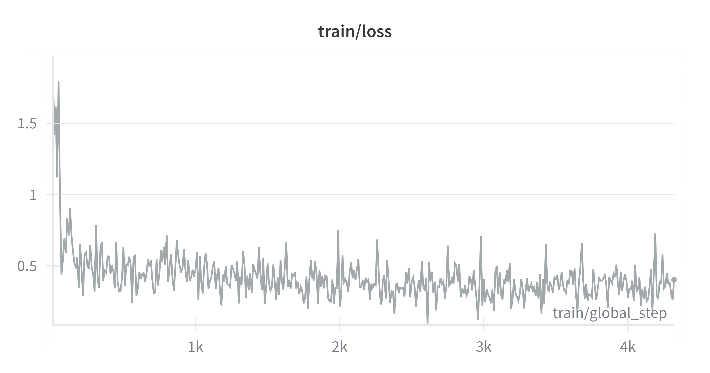
*Figure 6: Training loss progression showing model convergence during fine-tuning*

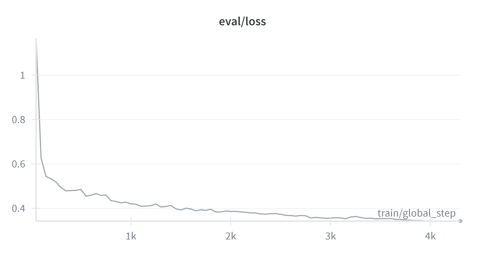
*Figure 7: Validation loss tracking demonstrating model generalization performance*

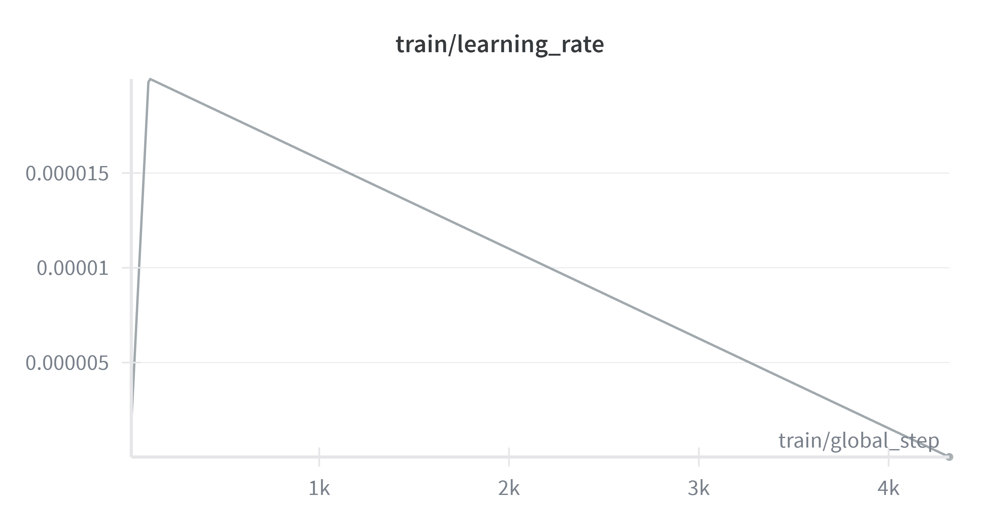
*Figure 8: Learning rate scheduling optimization for stable training convergence*

## DESIGNS
### Authentication System
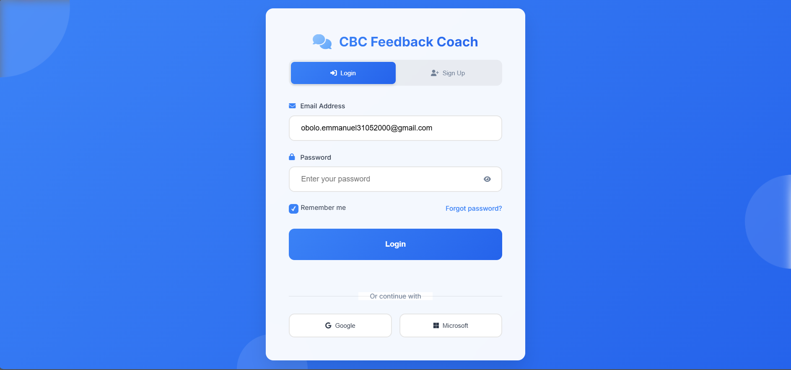
*Figure 9: User login interface with secure authentication*

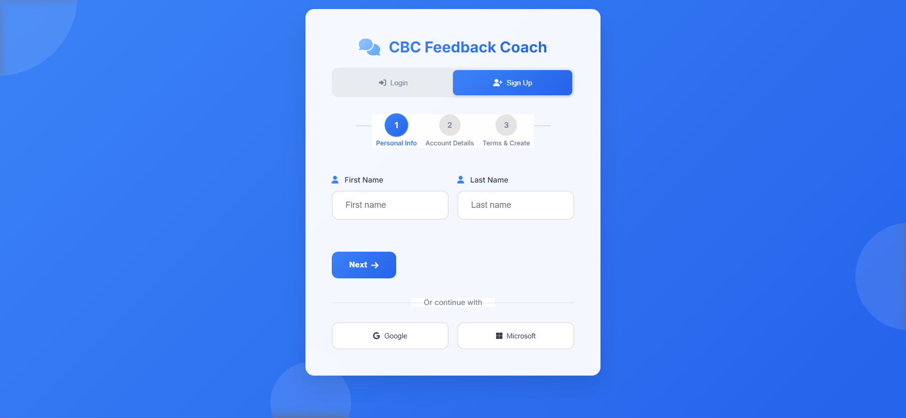
*Figure 10: Registration process - Step 1: Basic account information i.e. personal details (first name, last name)*

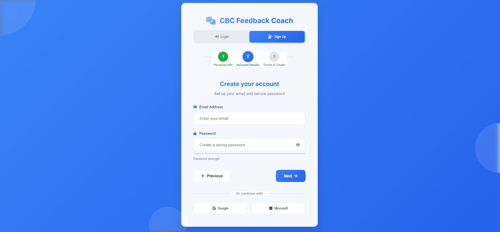
*Figure 11: Registration process - Step 2: email and password`*

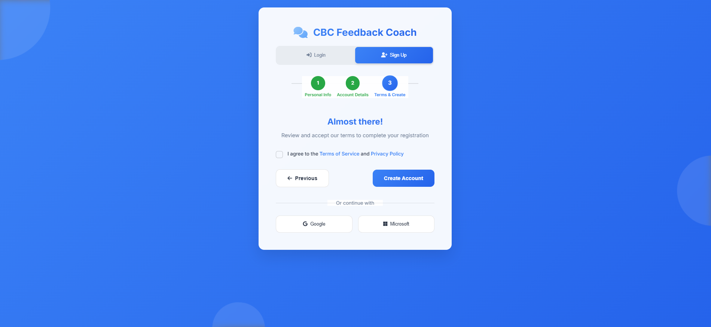
*Figure 12: Registration process - Step 3: Terms of service and Privacy agreement*

### Main Dashboard
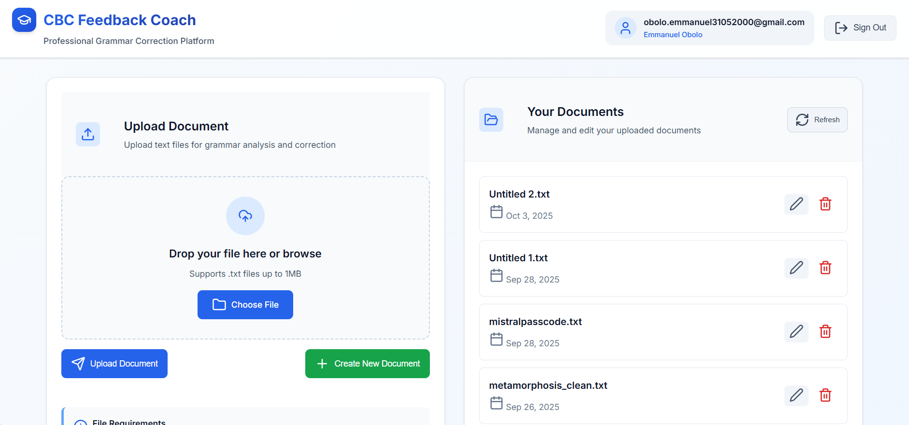
*Figure 13: Main dashboard interface*

### Text Editor Interface
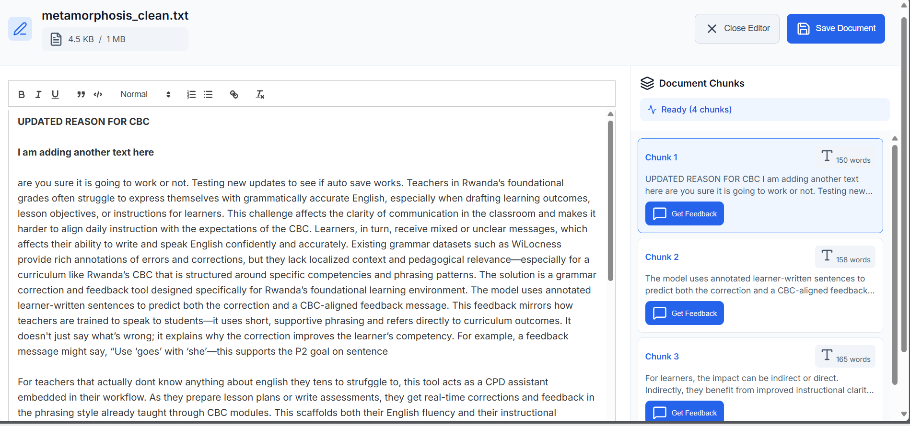
*Figure 14: Integrated text editor*

### Grammar Correction Modal
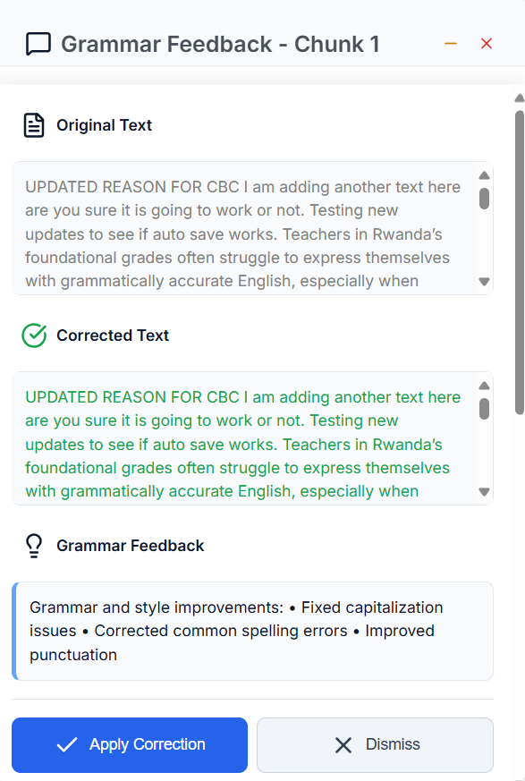
*Figure 15: Detailed feedback modal showing grammar corrections with CBC-aligned Feedback*

## Development Plan
Currently I have not written the deployment plan in words I have only my sketched plan
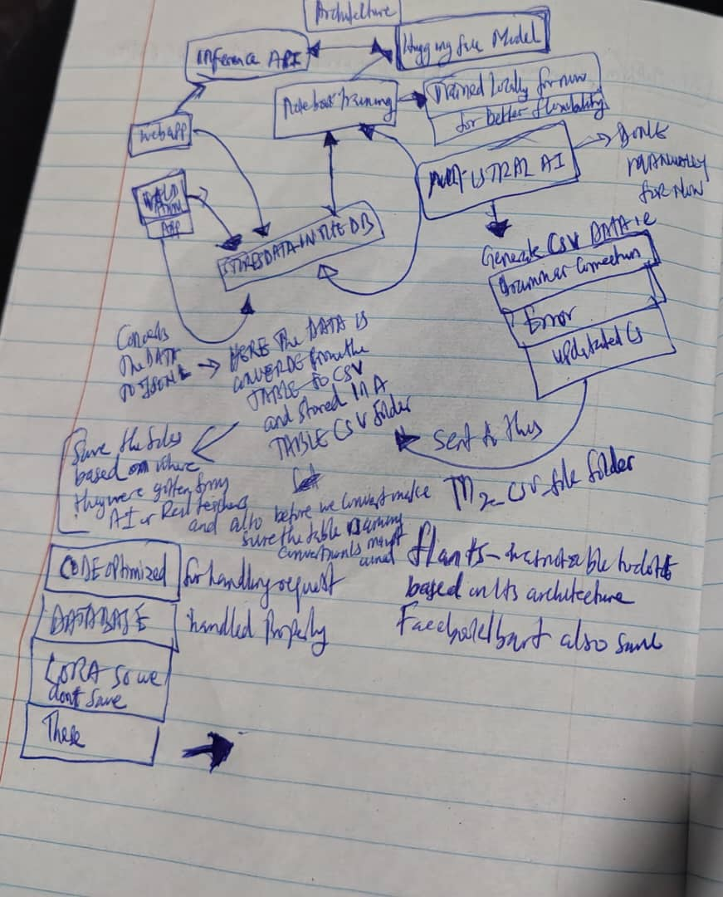


## Training Setup (Google Colab)

### Prerequisites

- Google Colab Pro account with GPU access
- Hugging Face account for model access
- Weights & Biases (wandb.ai) account for training metrics visualization
- GitHub account to clone the repository

### Account Setup Requirements

1. **Hugging Face Setup:**
   - Create a Hugging Face account at [huggingface.co](https://huggingface.co)
   - Generate your API token: Go to Settings → Access Tokens → Create new token
   - Accept the Mistral 7B terms and conditions at [Mistral-7B-Instruct-v0.1](https://huggingface.co/mistralai/Mistral-7B-Instruct-v0.1)

2. **Weights & Biases Setup:**
   - Create a wandb.ai account at [wandb.ai](https://wandb.ai)
   - Generate your API key: Go to Settings → API Keys → Copy your API key
   - This will be used for training metrics visualization and monitoring

### Setup Instructions and Training Process

1. **Open the training notebook:**
   - Use `TRAINING_DUAL_TASK_GRAMMAR_CORRECTION_AND_CBC_FEEDBACK_MISTRAL_7B_INSTRUCTION.ipynb` for dual-task training

1. **Enable GPU in Colab:**
   - Go to Runtime → Change runtime type
   - Select GPU as Hardware accelerator
   - Choose T4 or A100 GPU for optimal performance

2. **Upload your training data:**
   - upload the pre-processed `cbc_dataset.jsonl` file directly to collab from local pc when asked to upload in a cell

2. **Run cells sequentially:**
   - Follow the notebook structure from data loading to model evaluation
   - The training is optimized for Colab's GPU environment

3. **Monitor training progress:**
   - Training loss and validation metrics are displayed during training
   - Model checkpoints are automatically saved and can be downloaded

## Frontend and Backend Application Setup

The CBC Feedback Coach application consists of a FastAPI backend with HTML/CSS/JavaScript frontend components. This section provides comprehensive setup instructions for the web application.

### Prerequisites

- Python 3.8 or higher
- PostgreSQL 12 or higher
- Git

### Environment Configuration

1. **Clone the repository:**
   ```bash
   git clone https://github.com/eobolo/MISSION_CAPSTONE_SOFTWARE_ENGINEERING.git
   cd MISSION_CAPSTONE_SOFTWARE_ENGINEERING
   ```

2. **Create and activate virtual environment:**
   ```bash
   # Using venv (recommended)
   python -m venv venv
   
   # On Windows
   venv\Scripts\activate
   
   # On macOS/Linux
   source venv/bin/activate
   ```

3. **Install dependencies:**
   ```bash
   pip install -r requirements.txt
   ```

4. **Configure environment variables:**
   
   Create a `.env` file in the project root with the following variables:
   ```env
   DB_PASSWORD=your_postgres_password
   AUTH_SECRET=your_jwt_secret_key_here
   ```
   
   Replace the placeholder values with your actual PostgreSQL password and a secure JWT secret key.

### Database Setup

1. **Install and start PostgreSQL:**
   
   - Download and install PostgreSQL from [postgresql.org](https://www.postgresql.org/download/)
   - Start the PostgreSQL service
   - Note the password you set for the `postgres` user during installation

2. **Install pgAdmin:**
   
   - Download pgAdmin from [pgadmin.org](https://www.pgadmin.org/download/)
   - Install pgAdmin (available for Windows, macOS, and Linux)
   - Launch pgAdmin after installation

3. **Configure pgAdmin Connection:**
   
   - Open pgAdmin and create a new server connection
   - **General Tab:**
     - server name: `CBC_FEEDBACK_COACH_LOCAL_SERVER`
   - **Connection Tab:**
     - Host name/address: `localhost` or `127.0.0.1`
     - Port: `5432`
     - Username: `postgres`
     - Password: (the password you set during PostgreSQL installation)
   - Click "Save" to establish the connection

4. **Create Application Database:**
   
   - In pgAdmin, right-click on "Databases" under your server
   - Select "Create" → "Database..."
   - **Database name:** `cbc_coach`
   - Click "Save" to create the database
   
   **Note:** The application will automatically create all required tables (users, documents, training_data) when you first run it.

5. **Database Configuration:**
   
   The application expects the following database configuration:
   - Database name: `cbc_coach`
   - Username: `postgres`
   - Host: `127.0.0.1`
   - Port: `5432`
   
   Update the `DB_CONFIG` in `app/database/db_config.py` if your setup differs.

### Running the Application

1. **Start the development server:**
   ```bash
   uvicorn app.main:app --reload --host 127.0.0.1 --port 8000
   ```

2. **Access the application:**
   - Main application: http://127.0.0.1:8000/
   - API documentation: http://127.0.0.1:8000/docs
   - Authentication page: http://127.0.0.1:8000/
   - Dashboard: http://127.0.0.1:8000/dashboard