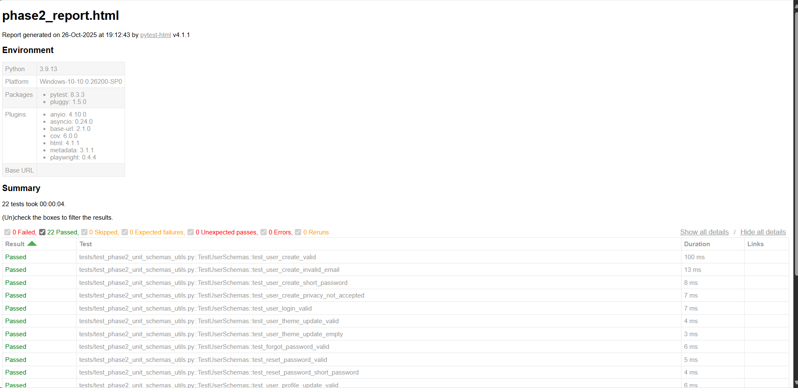
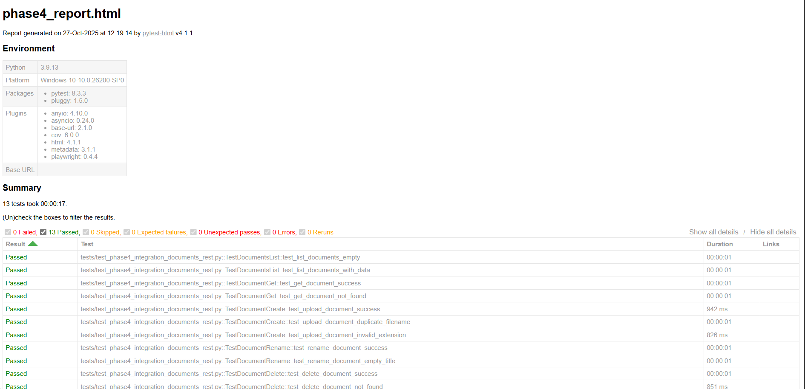
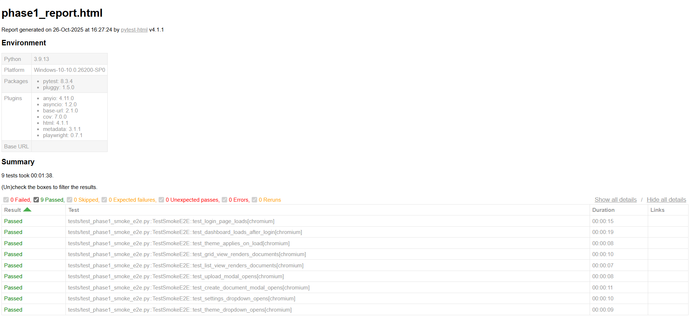
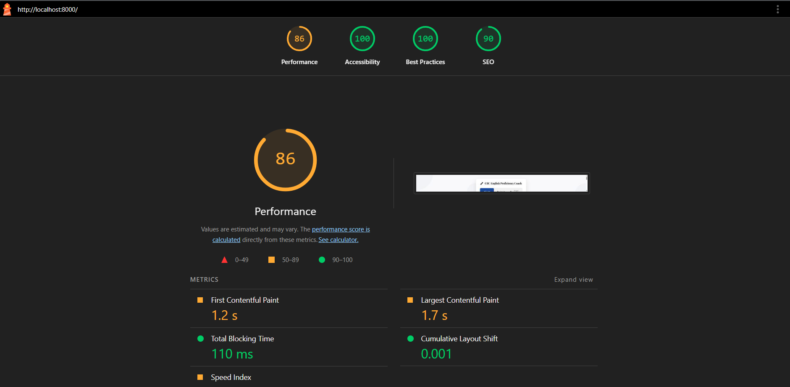
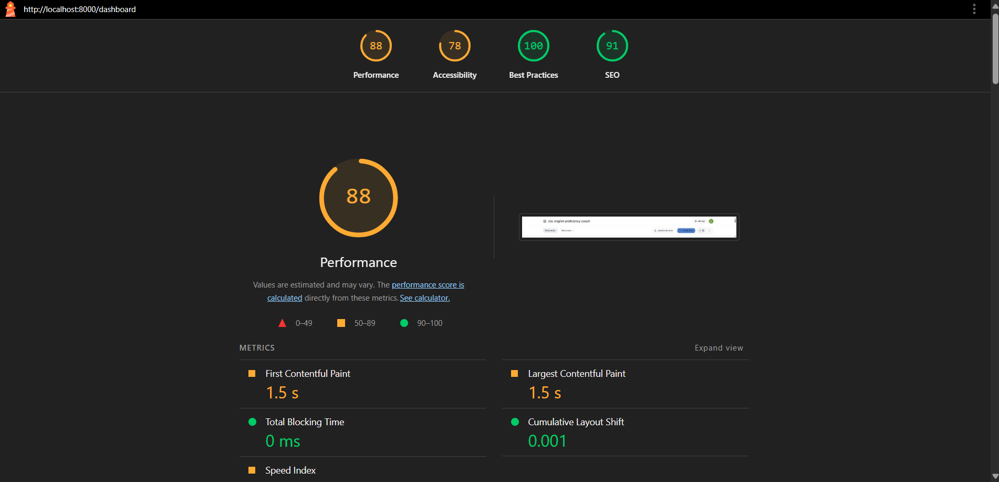
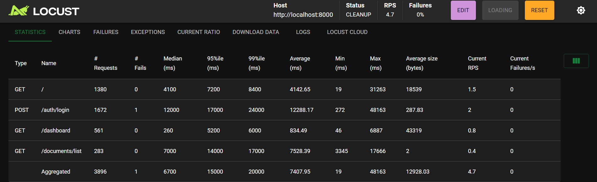

# Project Results Analysis: CBC English Proficiency Coach

## Executive Summary

This report provides a comprehensive analysis of the CBC English Proficiency Coach system development, evaluating the extent to which project objectives were achieved across both the machine learning (ML) components and web application. The analysis is grounded in quantitative metrics, testing results, and documented limitations from the implementation phases.

## 1. Machine Learning Model Achievements

### 1.1 Model Performance and Training

The fine-tuned Mistral 7B v0.1 model successfully achieved the primary objective of grammatical error correction with CBC-aligned feedback generation. The model demonstrates strong generalization capabilities, as evidenced by training loss of 0.24 and validation loss of 0.35, which indicates no significant overfitting despite the high evaluation metrics achieved. Evaluation metrics reached 99% for both BLEU and ROUGE scores. While such high scores might typically raise concerns about overfitting, the loss values confirm that the model achieved genuine learning rather than memorization. The high scores reflect the moderate complexity of the training dataset composed of the Wi+Locness corpus and augmented CBC-aligned feedback, which primarily contains English text appropriate for Primary 3 teacher-student interactions in Rwanda's education system—sentence structures and grammatical patterns that are not overly complex. However, despite being trained on moderately complex data, the Mistral 7B model's foundational architecture and 7 billion parameters provide the capacity to handle higher complexity English correction tasks beyond the P3 level, demonstrating scalable learning capabilities for the model.

The model successfully demonstrated its ability to:
- Correct English grammatical errors accurately
- Extract and replicate patterns from the augmented CBC feedback designed for training
- Generate contextually appropriate, pedagogy-aligned feedback augmented from following Rwanda's Competence-Based Curriculum guidelines

### 1.3 Model Limitations

#### Regional Bias Concerns
Despite training on the Wi+Locness dataset and CBC guidelines, the model may exhibit regional bias. The Wi+Locness dataset primarily reflects English usage patterns from European academic contexts, while the CBC guidelines used for feedback generation offer general principles but lack concrete examples specific to Rwandan classrooms. This concern aligns with broader findings on bias inheritance in large language models, where synthetic data constituting over 50% of training material is often generated by LLMs trained on web-crawled data that reflects social biases. Regional bias has been empirically observed in generated datasets, where certain regions appear disproportionately represented.

**Mitigation Strategy:** The pilot phase is designed to gather diverse teacher experiences in English usage and CBC implementation. When inaccuracies are identified, teachers can provide corrected versions, which will be used to build region-specific training data better reflecting Rwanda's educational context.

#### Translation Model Limitations
The integrated Facebook NLLB-200-distilled-600M translation model, while functioning correctly, acknowledges several limitations. Mistranslations may occur despite optimization efforts, which could negatively impact users relying on output for important instructional decisions. Additionally, there remains a possibility that personally identifiable information was not fully eliminated from the training data.

**Mitigation Strategy:** The software includes a clear disclaimer informing users that translations are not guaranteed to be 100% accurate and should be reviewed carefully. Teachers must agree to this disclaimer before using the tool, acknowledging that translations assist rather than replace human judgment.

## 2. Web Application Achievements

### 2.1 Functionality Completion

All project milestones from the Gantt chart were successfully met, and comprehensive testing confirms that both functional and non-functional requirements have been achieved.

#### Functional Requirements Fulfilled:
- **User Authentication:** Signup, login, password reset, Google OAuth integration, JWT-based session management
- **Document Management:** Upload, create, list, retrieve, rename, delete, auto-save functionality
- **Grammar Correction Interface:** Real-time processing, text chunking, feedback display, CBC-aligned responses
- **Translation Support:** English-to-Kinyarwanda translation with user disclaimers
- **Theme Customization:** Light/dark mode with persistent preferences
- **Profile Management:** User profile viewing and editing capabilities

#### Non-Functional Requirements Met:
- **Security:** Password hashing with bcrypt, JWT tokens, authentication checks on protected endpoints
- **Performance:** Lighthouse score of 86/100 on authentication page (FCP: 1.2s, LCP: 1.7s)
- **Scalability:** Successfully handles 50 concurrent users with 99.97% success rate
- **Reliability:** Comprehensive error handling, graceful failure management
- **Usability:** Intuitive interface inspired by Google NotebookLM, tested through E2E scenarios

### 2.2 Testing Coverage

#### Unit Testing
Unit tests validated individual components including Pydantic schema validators, JWT token management, and password hashing functions. All tests passed successfully, confirming that data models enforce business rules, tokens are properly created and verified, and password security is maintained.

#### Validation Testing
Validation tests ensured data validation mechanisms work correctly across all user inputs, including valid user creation, invalid email formats, password length requirements, privacy policy acceptance, and profile update constraints.

*Figure: Unit and validation testing results showing successful validation of schemas, JWT utilities, and password hashing*

#### Integration Testing
Integration tests validated component interactions including:
- Authentication system integration with database
- JWT token validation for protected endpoints
- Theme preference persistence
- Document management operations (CRUD operations, file upload, metadata retrieval, timestamp updates)

*Figure: Authentication REST API integration test results*

*Figure: Document REST API integration test results*

#### Functional and System Testing
End-to-end smoke tests verified critical user workflows including login functionality, dashboard loading, theme application, document view rendering, modal operations, and settings functionality.

*Figure: End-to-end smoke test results demonstrating successful workflow execution*

#### Performance Testing
Lighthouse audits demonstrated optimized performance with:
- First Contentful Paint: 1.2s (passed)
- Total Blocking Time: 110ms (passed)
- Speed Index: 1.9s (passed)
- Largest Contentful Paint: 1.7s (passed)
- Cumulative Layout Shift: 0.001 (passed)

Performance optimizations implemented include:
- GZip compression middleware for text resources
- Deferred loading of non-critical CSS and JavaScript
- Preconnect hints for third-party resources

*Figure: Lighthouse performance test results for authentication page*

*Figure: Lighthouse performance test results for dashboard*

#### Scalability Testing
Load testing with 50 concurrent users over 7 minutes (3,896 total requests) revealed:
- Overall success rate: 99.97% (1 failure)
- Dashboard endpoint: 260ms median response time
- Authentication endpoint: 12-second median response time (bottleneck)
- System stability under load with no crashes

*Figure: Locust scalability test results showing system performance under 50 concurrent users*

### 2.3 Web Application Limitations

#### Performance Bottleneck in Authentication
The authentication endpoint (POST /auth/login) emerged as a performance bottleneck during scalability testing, with a median response time of 12 seconds under load compared to 260ms for the dashboard. This suggests database query contention during concurrent user authentication attempts, indicating a need for database query optimization, indexing strategies, and potentially connection pooling enhancements for production deployment.

#### Text Insertion Truncation Issue
The functionality for automatically inserting corrected text for a particular chunk sometimes truncates text from the next chunk. This represents a partial achievement of the requirement, as the core functionality works but edge cases involving chunk boundaries are not fully resolved.

## 3. Recommendations to the Community

### 3.1 Responsible Use and Awareness

**Human Oversight Required:** Teachers using the CBC English Proficiency Coach should understand that AI-generated grammar corrections and feedback are meant to support, not replace, professional judgment. While the system implements state-of-the-art models and mitigation strategies, teachers must review all corrections before applying them to avoid inadvertently teaching grammatical errors to students. This aligns with UNESCO's Ethics of Artificial Intelligence principle of human oversight and determination, ensuring human responsibility remains at the center of educational decisions.

**Translation Accuracy Disclaimer:** The translation feature of english to kinyarwanda and vice-versa includes an explicit disclaimer in the terms of service and privacy policy that translations are not guaranteed to be 100% accurate. Users must agree to this disclaimer before accessing translation services, acknowledging that they understand the limitations of AI translation models. Teachers are advised to use translations as supplementary aids for understanding grammar corrections and CBC feedback, but should verify translations carefully, especially when making instructional decisions that directly impact student learning.

### 3.2 Academic Integrity and Professional Practice

**Feedback as Learning Tool:** The system is designed to help teachers improve their English proficiency and internalize CBC-aligned feedback practices. Teachers should view the corrections and feedback as opportunities for professional development rather than judgment of their current skills. The feedback system is intentionally structured to be constructive and supportive, following Rwanda's CBC guidelines that emphasize praising correct performance, offering clear guidance, and focusing on learning processes.

**Contribution to Model Improvement:** Teachers are encouraged to provide corrections when they identify inaccuracies in AI-generated grammar corrections or feedback. These contributions directly support the refinement of the model and the development of a more locally responsive educational tool. By submitting corrections, teachers participate in building region-specific training data that better reflects Rwanda's educational context, ultimately benefiting the broader teacher community.

### 3.3 Data Privacy and Security

**Personal Information Protection:** The system collects minimal personally identifiable information (first name, last name, email) for authentication purposes only. All user data is securely stored with JWT-based authentication ensuring that users can only access their own information. Teachers should use strong passwords and not share their login credentials to maintain account security.

**Anonymous Data Collection:** Grammar corrections and CBC-aligned feedback submitted for model refinement are fully anonymized—no user identifiers are associated with submissions. This ensures that contributions to model improvement remain untraceable to individual teachers, protecting professional privacy while allowing collaborative improvement of the system.

### 3.4 Corrected Text Insertion Best Practices

**Manual Review of Insertions:** Due to the current limitation where automatically inserted corrections may sometimes truncate adjacent chunk text, teachers are advised to manually review all inserted corrections before finalizing their documents. While the core insertion functionality works for most cases, users should verify that chunk boundaries have not been disrupted, especially when working with longer documents containing complex text structures.

## 4. Future Work

### 4.1 Enhanced Testing and Code Maintenance

Due to time constraints during the initial development phase, only a subset of comprehensive tests were implemented. Future work will focus on expanding test coverage across all web application components, including additional end-to-end scenarios, edge case testing, and stress testing. The identified performance bottleneck in the authentication endpoint (12-second median response time under load) requires immediate attention through database query optimization, appropriate indexing strategies, and connection pooling enhancements. Future testing will address not only the current bottleneck but also proactively identify and resolve performance issues that may emerge as the user base grows. Additionally, establishing a robust code maintenance strategy will ensure long-term system reliability, security updates, and continued compatibility with evolving dependencies.

### 4.2 Document-Level Analysis Implementation

**Priority: Highest**

The current implementation processes documents by intelligently splitting text into chunks using spaCy's sentence boundary detection, then providing corrections and CBC aligned feedback on a chunk-by-chunk basis. This approach was developed due to initial limitations in expertise, knowledge, infrastructure, and dataset constraints. However, analyzing entire documents as a cohesive unit (similar to Grammarly's approach) would provide superior performance for several reasons.

When teachers advance in English proficiency and begin writing longer, more complex texts, analyzing the complete document context would enable more accurate grammatical error detection and more pedagogically sound CBC-aligned feedback. Document-level analysis would better capture:
- Inter sentence relationships and coherence
- Consistent terminology and style throughout the document
- Overall message clarity and communication effectiveness
- CBC alignment across the entire pedagogical context

This enhancement would also resolve the current text insertion truncation issue, as corrections could be applied more intelligently to the whole document rather than being constrained by chunk boundaries. Implementing document level analysis requires retraining the model on larger text samples and enhancing the infrastructure to handle complete documents efficiently, but represents the most significant improvement for supporting teachers' professional development trajectory from basic to advanced English proficiency.

### 4.3 Regional Bias Mitigation and Local Customization

The Wi+Locness dataset used for initial training primarily reflects European English norms, creating potential regional bias in grammar corrections and feedback. Future work will involve retraining the model using appropriate datasets that better represent Rwandan English usage patterns and cultural contexts. This requires collecting data from teachers using the system, incorporating their corrections into the training dataset, and iteratively fine-tuning the model to become more locally responsive. The goal is to create a model that not only corrects grammatical errors but does so in ways that align with Rwandan educational norms and CBC implementation practices specific to the local classroom context.

### 4.4 Multi-Format Support and Collaborative Platform

**File Format Expansion:** Currently, the system supports text-based document uploads. Future enhancements will allow teachers to upload documents in various formats (DOCX, PDF, etc.), automatically extract the text content, process it through the grammar correction and CBC feedback system, and download the corrected version in the original format. This will significantly improve workflow efficiency and reduce manual transcription efforts.

**Teacher Collaboration Platform:** The system should evolve into a collaborative platform where teachers can share files, exchange feedback, and learn from each other's experiences. This requires proper product design to ensure an intuitive user interface that supports professional learning communities within Rwanda's education system. A dedicated product designer will be essential for creating an interface that seamlessly integrates file sharing, correction workflows, and social learning features while maintaining the core CBC English proficiency coaching functionality.

## 5. Conclusion

The CBC English Proficiency Coach represents a successful implementation of AI assisted educational technology for teacher professional development in Rwanda's Competence Based Curriculum context. The system achieved its primary objectives in model performance, web application functionality, and comprehensive testing, while establishing a clear roadmap for future enhancements that will address current limitations and expand the platform's capabilities to better serve Rwanda's teaching community.
